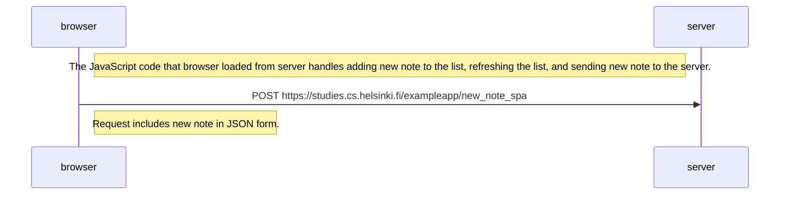

```mermaid
sequenceDiagram
    participant browser
    participant server

    Note right of browser: The JavaScript code that browser loaded from server handles adding new note to the list, refreshing the list, and sending new note to the server.
    
    browser->>server: POST https://studies.cs.helsinki.fi/exampleapp/new_note_spa
    Note right of browser: Request includes new note in JSON form.
```